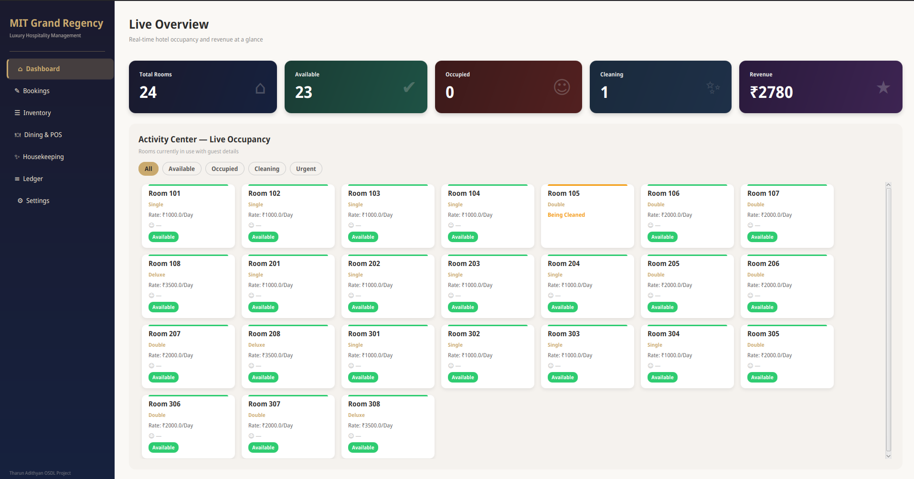

# MIT Grand Regency — Hotel Management System

A full-featured **JavaFX hotel property management system** for the MIT Grand Regency hotel. Manages room bookings, guest check-in/check-out with Aadhaar ID verification, restaurant POS, housekeeping workflows, PDF invoicing, email notifications, and a financial ledger.



---

## Tech Stack

| Component       | Technology                     |
|-----------------|--------------------------------|
| Language        | Java 17+                       |
| UI Framework    | JavaFX 21                      |
| Database        | MariaDB 10.x+                  |
| PDF Generation  | Apache PDFBox 3.0.1            |
| Email           | Jakarta Mail 2.0.1 (Gmail SMTP)|
| Build System    | Apache Maven                   |

---

## Prerequisites

- **JDK 17+** (OpenJDK or Oracle JDK)
- **MariaDB** (or MySQL) running on `localhost:3306`
- **Apache Maven** 3.8+

---

## Setup Instructions

### 1. Clone the repository

```bash
git clone https://github.com/TharunAdithyan120506/Hotel-Management.git
cd Hotel-Management
```

### 2. Configure credentials

```bash
cp hotel_settings.properties.example hotel_settings.properties
```

Edit `hotel_settings.properties` with your real values:

```properties
db.url=jdbc:mariadb://localhost:3306/mit_grand_regency
db.user=your_username
db.password=your_password
mail.username=your_email@gmail.com
mail.password=your_app_password
```

### 3. Create the database

**Fresh install:**
```bash
mysql -u root -p < db/schema.sql
```

**Migrating from existing install:**
```bash
mysql -u root -p mit_grand_regency < db/migrate.sql
```

### 4. Run the application

```bash
mvn javafx:run
```

---

## Database Schema

```sql
CREATE TABLE settings (
    setting_key   VARCHAR(50) PRIMARY KEY,
    setting_value VARCHAR(100)
);

CREATE TABLE rooms (
    room_number          VARCHAR(10) PRIMARY KEY,
    room_type            VARCHAR(20),
    price                DOUBLE,
    status               VARCHAR(30) DEFAULT 'Available',
    customer_name        VARCHAR(100),
    contact_number       VARCHAR(20),
    guest_email          VARCHAR(100),
    guest_address        VARCHAR(255),
    check_in_date        DATE,
    expected_checkout_date DATE,
    aadhaar_path         VARCHAR(255),
    checkout_time        VARCHAR(30),
    priority             BOOLEAN DEFAULT FALSE
);

CREATE TABLE checkout_history (
    id               INT AUTO_INCREMENT PRIMARY KEY,
    room_number      VARCHAR(10),
    room_type        VARCHAR(20),
    guest_name       VARCHAR(100),
    contact_number   VARCHAR(20),
    guest_email      VARCHAR(100),
    guest_address    VARCHAR(255),
    check_in_date    VARCHAR(20),
    checkout_date    VARCHAR(20),
    price_per_night  DOUBLE DEFAULT 0,
    nights           INT DEFAULT 0,
    subtotal         DOUBLE DEFAULT 0,
    tax_amount       DOUBLE DEFAULT 0,
    gst_rate         DOUBLE DEFAULT 18,
    total_paid       DOUBLE DEFAULT 0,
    booked_at        DATETIME,
    aadhaar_path     VARCHAR(255),
    payment_mode     VARCHAR(30),
    transaction_id   VARCHAR(100)
);

CREATE TABLE menu_items (
    item_code  VARCHAR(20) PRIMARY KEY,
    item_name  VARCHAR(100),
    category   VARCHAR(50),
    unit_price DOUBLE
);

CREATE TABLE restaurant_orders (
    id          INT AUTO_INCREMENT PRIMARY KEY,
    room_number VARCHAR(10),
    guest_name  VARCHAR(100),
    item_code   VARCHAR(20),
    item_name   VARCHAR(100),
    category    VARCHAR(50),
    unit_price  DOUBLE,
    quantity    INT,
    total_price DOUBLE,
    order_time  DATETIME,
    settled     BOOLEAN DEFAULT FALSE
);
```

---

## Project Structure

```
Hotel-Management/
├── src/
│   └── main/
│       ├── java/com/mitgrandregency/hotel/
│       │   ├── model/
│       │   │   ├── Room.java
│       │   │   ├── HistoryRecord.java
│       │   │   ├── MenuItem.java
│       │   │   ├── RestaurantOrder.java
│       │   │   └── AppState.java
│       │   ├── dao/
│       │   │   ├── ConfigLoader.java
│       │   │   ├── DatabaseManager.java
│       │   │   ├── RoomDAO.java
│       │   │   ├── HistoryDAO.java
│       │   │   ├── MenuDAO.java
│       │   │   ├── OrderDAO.java
│       │   │   └── SettingsDAO.java
│       │   ├── service/
│       │   │   ├── AadhaarStorageService.java
│       │   │   ├── BookingService.java
│       │   │   ├── InvoiceService.java
│       │   │   ├── EmailService.java
│       │   │   └── ReportService.java
│       │   └── ui/
│       │       ├── MainApp.java
│       │       ├── DashboardView.java
│       │       ├── BookingsView.java
│       │       ├── InventoryView.java
│       │       ├── RestaurantView.java
│       │       ├── HousekeepingView.java
│       │       ├── LedgerView.java
│       │       ├── SettingsView.java
│       │       └── UIUtils.java
│       └── resources/
│           └── styles.css
├── db/
│   ├── schema.sql
│   └── migrate.sql
├── docs/
│   └── screenshot.png
├── .gitignore
├── hotel_settings.properties.example
├── pom.xml
└── README.md
```

---

## Features

- **Dashboard** — Real-time stat cards (total rooms, available, occupied, cleaning, revenue) with animated bento-box room tiles and filter bar
- **Room Bookings** — Guest check-in with Aadhaar ID upload, check-out with billing preview, stay extension, urgent-cleaning flagging
- **Inventory Management** — Add/remove rooms, CSV bulk import
- **Dining & POS** — Menu management with CSV import, room-linked ordering for occupied rooms
- **Housekeeping** — Cleaning queue with urgent priority highlighting, one-click mark-as-available
- **Financial Ledger** — Complete checkout history, multi-mode payment tracking (Cash/Card/UPI) with transaction ID validation, re-invoice PDF generation, CSV ledger export
- **PDF Invoicing** — Branded invoices with room charges, restaurant line items, and GST breakdown
- **Email Notifications** — Send invoices via Gmail SMTP with branded HTML email
- **Settings** — Configurable room pricing and GST rates, persisted to database
- **Aadhaar Storage** — Guest ID images saved to local filesystem (not database blobs)

---

## Architecture

The project follows the **MVC pattern** with clear separation of concerns:

- **Model** — POJOs with JavaFX observable properties for reactive UI binding
- **DAO** — Database access layer using `PreparedStatement` exclusively (no SQL injection risk)
- **Service** — Business logic (booking, invoicing, email, reporting, file storage)
- **UI** — JavaFX view classes receiving dependencies via constructor injection

All shared state is centralized in `AppState`, instantiated once in `MainApp` and passed to every component that needs it.

---

## License

MIT License — see [LICENSE](LICENSE) for details.
